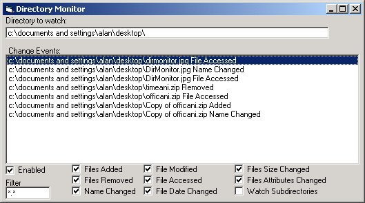

<div align="center">

## Dir Monitor Update


</div>

### Description

Monitor all files in a directory & subdirectories for any change in size, attributes, date, access date, modified date, name, and more. Fixed some missed events from last version, and added a few more. Also, added the ability to check sub directories, and add search filters (*.exe, etc..) Also switched to a class based timer, and api file/directory calls instead of slow dir/fso calls. Special thanks to Dana Seaman for the suggestions and input on this update.
 
### More Info
 
Path to be monitored

(optional) change in default events to monitor and whether or not sub directories will be searched. Also, refresh interval can be changed.

Assumes you know how to compile and reference an activex dll in your own project, although simple instructions are provided.

name and path of file changed, and what change occured.

A low refresh rate can hog system resources.

Checking sub directories is not recommended, unless there are only a few.


<span>             |<span>
---                |---
**Submitted On**   |2001-06-19 14:43:14
**By**             |[Alan Toews](https://github.com/Planet-Source-Code/PSCIndex/blob/master/ByAuthor/alan-toews.md)
**Level**          |Intermediate
**User Rating**    |5.0 (35 globes from 7 users)
**Compatibility**  |VB 6\.0
**Category**       |[Files/ File Controls/ Input/ Output](https://github.com/Planet-Source-Code/PSCIndex/blob/master/ByCategory/files-file-controls-input-output__1-3.md)
**World**          |[Visual Basic](https://github.com/Planet-Source-Code/PSCIndex/blob/master/ByWorld/visual-basic.md)
**Archive File**   |[Dir Monito213696192001\.zip](https://github.com/Planet-Source-Code/alan-toews-dir-monitor-update__1-24225/archive/master.zip)

### API Declarations

```
'Several. See Code
```


